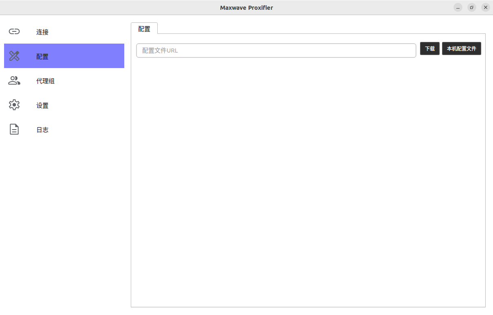
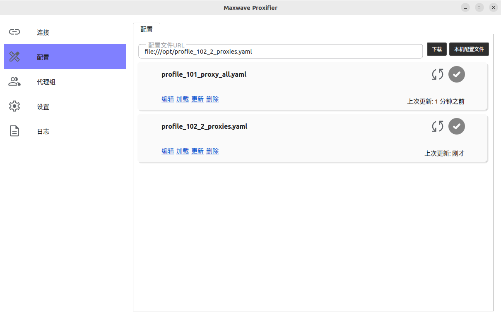
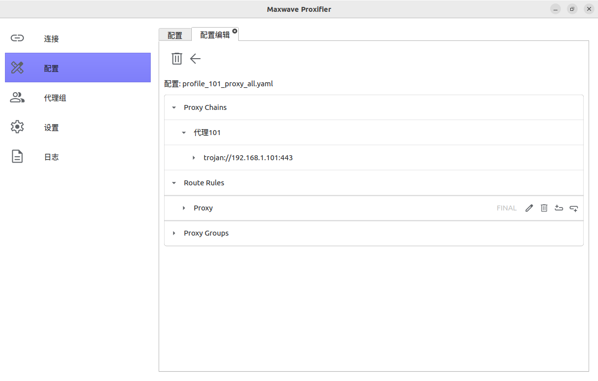
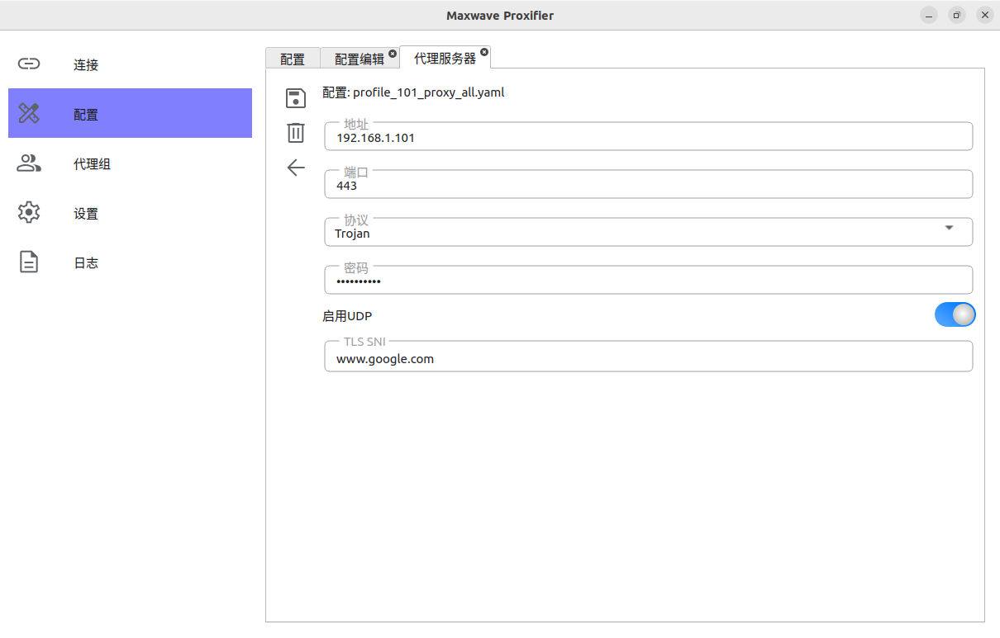

# Maxwave Proxifier基础用法

### 配置文件
Maxwave Proxifier是由配置(Profiles)驱动的代理客户端。一个典型的配置文件通常包括代理服务器、代理组，以及转发规则的描述。例如，下面的配置定义了类型为trojan的代理服务器，并指定Maxwave Proxifier将所有的本机网络数据都通过该代理进行转发:

例子1：
```
# profile_101_proxy_all.yaml

proxies:
- name: 代理101
  type: trojan
  server: 192.168.1.101
  port: 443
  password: trojanpass
  udp: true
  sni: www.google.com

rules:
- FINAL,代理101
```

代理服务器的描述由`proxies:`起行。每一个代理服务必须包含一个名字(name)、地址(域名或IP地址)、端口等信息。所有类型的代理服务器都支持TCP转发。对于类型为trojan的代理服务器而言。可以选择是否打开UDP转发。对于支持TLS的代理类型而言，可以指定一个SNI。在此例中，代理服务器打开了UDP转发(udp: true)，并指定SNI为www.google.com

转发规则的描述由`rules:`起行。每一行指定了一条转发规则。在此例中，`FINAL,代理101`将使得Maxwave Proxifier让所有的本机网络数据通过trojan代理进行转发。

例子2：
```
# profile_101_2_proxies.yaml

proxies:
- name: 代理101
  type: trojan
  server: 192.168.1.101
  port: 443
  password: trojanpass
  udp: true
  sni: www.google.com

- name: 代理102
  type: ssh
  server: 192.168.1.102
  port: 22
  username: ssh_user1
  password: sshpass

rules:
- DOMAIN-SUFFIX,google.com,代理101
- DOMAIN-SUFFIX,youtube.com,代理101
- DOMAIN-SUFFIX,bing.com,代理102
- DOMAIN-SUFFIX,microsoft.com,代理102
- FINAL,DIRECT

```

### 导入配置
配置需导入后放可以使用。在主界面左侧，选择`配置`，右侧点击`本级配置文件`按钮：


选择打开配置文件，文件即被加载。例如，上面两个配置文件被加载后，将会显示在`配置`页面中：


在相应的配置标签上点击`编辑`，可以查看**并编辑**配置文件的详细内容，例如代理服务器：



### 配置起效
在相应的配置标签上点击`加载`，将使相应的配置生效。同一时刻只能有一个配置文件生效：

